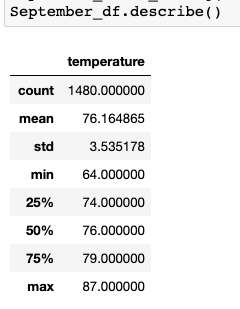

# surfs_up

## Project Overview

We are trying to open a Surf n' Shake shop in Oahu and we will be exploring temperature data for the months of June and December. The purpose of this project is to use SQLite and SQLAlchemy to run analytics on a weather dataset of Oahu and determine if the Surf n' Shake shop business is sustainable year-round.

## Results

Three key differences in weather between June and December
 - The average weather in June is 74.9 degrees anmd the average weather in December is 71 degrees.
 
 - In June, the lowest recorded temperature is 64 degrees while the lowerst temperature in December is 56 degreees.
 
 - There are a lot more weather records recorded durin June (1700 temperatures recorded) than there are in December (1517 temperatures recorded).
 
 June weather statistics

December weather statistics

## Summary
Based on the weather summary statistics, we can determine the average weather will be in the 70s during the summer and winter seasons. While we have information about these two seasons, this is not enough to confirm year-round sustainability. I recommend we run two more queries, one to find temperatures during March and one  to find temperatures during Septermber. This will give us a more detailed picture about the weather throughout the entire year.

March Temperature statistics

September Temperature statistics

